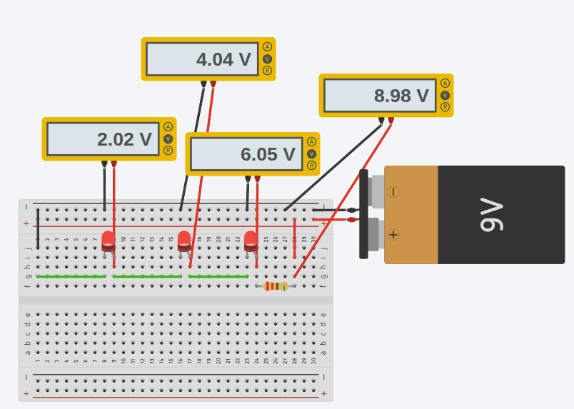
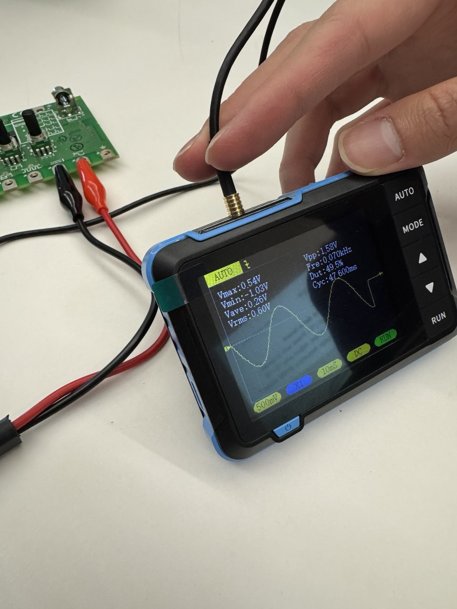
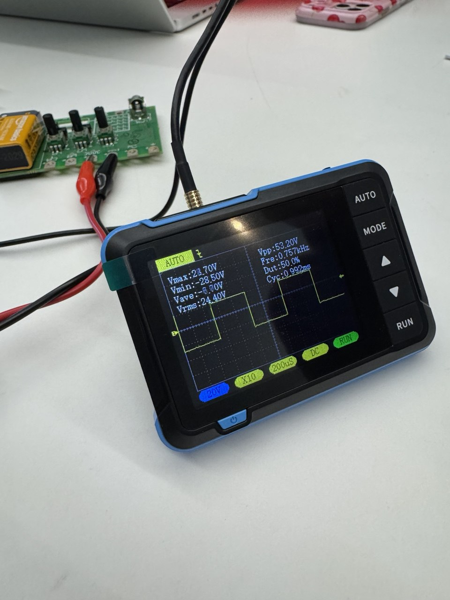

[<](README.md)

# Week 02 - DevLog

## Outcomes 

<!-- 
Using the backslash preserves the list number 
https://stackoverflow.com/a/50916345/441878 
-->

1\. Create an LED circuit with a ([class presentation](https://docs.google.com/presentation/d/1G4jdcr8KzWpIiIduQyFiQJEG-PFJHpovJb9rWhxhNYw/edit?slide=id.g1f89d7c4b1c_0_53#slide=id.g1f89d7c4b1c_0_53)). Record the voltage drop from each step and amps used in the circuit:

- Battery: 9V → after resistor: 6.87V → after LED: 0V - current through circuit: 0.6mA

2\. Create a three-LED circuit on Tinkercard and measure Voltage Drop and amps using their multimeters ([class presentation](https://docs.google.com/presentation/d/1G4jdcr8KzWpIiIduQyFiQJEG-PFJHpovJb9rWhxhNYw/edit?slide=id.g1f89d7c4b1c_0_53#slide=id.g1f89d7c4b1c_0_53)).

- [Tinkercad 3-LED circuit](https://www.tinkercad.com/things/jzLSDXF5Pj0-copy-of-9v-breadboard/editel?returnTo=https%3A%2F%2Fwww.tinkercad.com%2Fdashboard%2Fdesigns%2Fcircuits&sharecode=JX4-VW8qLR6UGgVEShvl-YIzlkQbjpe6gRG1l-4wApw) - battery: 8.98V, after 1st LED: 6.05V, after 2nd LED: 4.04V, after 3rd LED: 2.02V

3\. 📚 Read Chapter 02 - Musical Electricity for Electrophobes (39-45) in [Electronic music from scratch](https://www.makershed.com/products/make-electronic-music-pdf) (Pearson). Write a comment on one of Pearson's phrases that speaks to you. (2-3 sentences) 

"As synthesists, we have a lot more freedom when it comes to sounds we can easily make and the ease with which we can make them." This resonates because I've always seen electronic music and digital art as the future - when you remove physical constraints, what remains is purely human effort and imagination. Complexty and beauty become a direct function of how much creative energy you invest, which is a much more honest creative medium.

4\. Follow the Piezomania (39) and Sound through your skull (42) experiments. 

5\. Create a groundbreaking musical instrument using Pearson's advice in the conclusion of the chapter to customize your circuit to play sound in a new way.

- Pearson suggests building instruments from unconventional materials - attaching piezos to springs, rulers, or hardware store objects to capture new vibrations. In my version, I would probably experiment with attaching fruit as a touch-sensitive controller to adjust oscillator pitch.

6\. 📚 Read Chapter 03 - The Hello World Oscillator (46-59) in [Electronic music from scratch](https://www.makershed.com/products/make-electronic-music-pdf) (Pearson). In your own words, why should you be careful with capacitors?

- Polarity matters as electrolytic capacitors have a positive and negative leg, and plugging one in backward will at minimum break your circuit, and at higher voltages can cause the capacitor to literally explode
- some capacitors can store a dangerous amount of charge even after being disconnected from power (like the disposable camera flash example)

7\. What is the difference between an analog and digital component?

- An analog component works with continuous signals = voltage can be any value across a range. A digital component only deals in discrete states (e.g., 1 or 0). 

8\. [👉Activity: Analyze square waveforms with an oscilloscope](https://docs.google.com/presentation/d/1G4jdcr8KzWpIiIduQyFiQJEG-PFJHpovJb9rWhxhNYw/edit?slide=id.g3b8d920f8b7_0_49#slide=id.g3b8d920f8b7_0_49). On the Snap-on Waveform demo board, which pot controls variable voltage (duty cycle) and which controls variable frequency (PWM slides)? What is a common use of each? Post a photo of your testing.

- I'm not sure as some time has passed, but it seemed like pot 13 controlled frequency and pot 15 controlled duty cycle.

9\. 🎬 Watch [Synthesizing with Moog - Lesson 2: Dynamics](https://www.youtube.com/watch?v=gH4FNmoN7Z0) (15:33). Which tells us that every musical sound has three defining characteristics. What are they?

- The volume of the sound: **Loudness**
- The musical note played: **Pitch**
- The sonic signature of a sound distinguishing a note played on one instrument from the same note played on a different instrument: **Timbre**

<iframe width="560" height="315" src="https://www.youtube.com/embed/gH4FNmoN7Z0?si=the6122ZQvX1Yjif" title="YouTube video player" frameborder="0" allow="accelerometer; autoplay; clipboard-write; encrypted-media; gyroscope; picture-in-picture; web-share" referrerpolicy="strict-origin-when-cross-origin" allowfullscreen></iframe>

10\. If you were to make a list of your top 10 songs, share a link (e.g. youtube) to one that demonstrates an envelope generator at work, as well as the timecode for that position. Here is an example:

> The opening synth keyboard melody in Com Truise [Galactic Melt](https://www.youtube.com/watch?v=iOhpjcvtyVE&list=PLhpnnpt3tw-TQ102FLVMJabccj51wEeUH) uses a very short attack, making it punchy and alive. The base synth (`1:30`) uses a slower attack, adding to its weight and helping to ground the tempo. —Owen Mundy

- In the Frequency channel mix [１９８８　ＦＥＥＬＩＮＧ // Synthwave, Spacewave, Chillsynth, Lovewave](https://www.youtube.com/watch?v=H1xXIgRUPGY), around `0:40` there's a shift where a more rythmic and clear bass synth fades in - but not sure if that's the particualr envelope generator sound effect (or similar). 

## Other experiments

<!--
Share details about other electronic experiments you are working on this week?
-->

-

## Questions to bring up in class

<!--
Share questions you would like to bring up in class.
-->

- When extending circuits across multiple breadboards with jumper wires, are there signal integrity concerns at low voltages, or is it only relevant at higher frequencies?