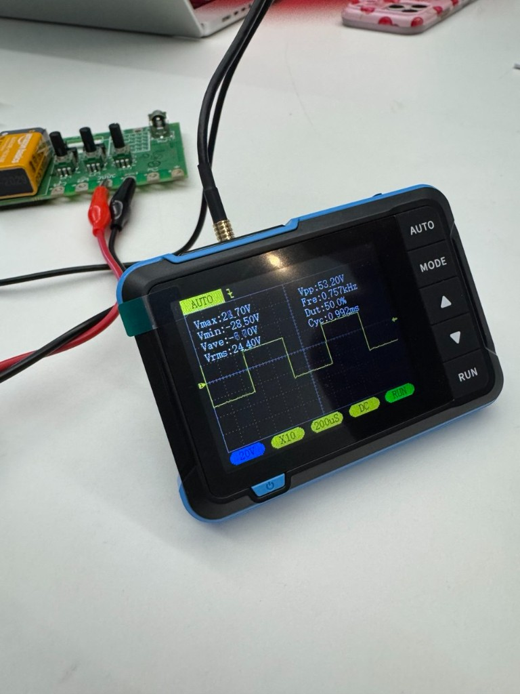

[<](README.md)

# Week 03 - DevLog

## Outcomes 

<!-- 
Using the backslash preserves the list number 
https://stackoverflow.com/a/50916345/441878 
-->

1\. 📚 Read Chapter 03 - The Hello World Oscillator (39-45) in [Electronic music from scratch](https://www.makershed.com/products/make-electronic-music-pdf) (Pearson). Write a comment on one of Pearson's phrases that speaks to you. (2-3 sentences) 

- "As it turns out, it’s much easier to get electrons to do your bidding than air molecules."

This line makes me think about how electronic music gives us more control over sound. Air feels unpredictable and hard to shape, but electrons are more manageable. Electronic instruments >>> else. 

˝
2\. Follow instructions in "My First Square Wave Oscillator" experiment (Pearson 59-71) to create a breadboard oscillator. Share a photo.

- 

  *Built the CD4093 oscillator with the original 0.1µF capacitor. Used an LED to verify the signal was there, turning the potentiometer adjusted the frequency a bit.*

3\. Create at least one variation on your oscillator inspired by four variations on the circuit. Share a video of your your device.

- https://jumpshare.com/share/U1Ok3LeZLE1Ffu60NW2g 

  *Added the LM386 amplifier. Speaker was slightly problematic, so switched to LED to test, but the frequency was too high to see any blinking. Swapped the capacitor on the CD4093 to 100µF, which slowed things down enough to visibly see the LED adjusting with the potentiometer. That's in the video.*

4\. 📚 Read Chapter 4 - Amps, Reverbs, and Talkboxes (72-75) in [Electronic music from scratch](https://www.makershed.com/products/make-electronic-music-pdf) (Pearson). 

- Done

5\. Once you start listening you'll hear it everywhere. Share a link to a song that uses a synthesizer below.

- https://www.youtube.com/watch?v=MV_3Dpw-BRY 

6\. Watch Synthesizer Basics: Amplitude, Oscillators, Timbre and describe
https://www.youtube.com/watch?v=c3udLCvoCC0 

- The video gives a basic overview of core synth concepts like amplitude, envelopes, frequency, oscillators, filters, timbre, LFOs, and modulation, showing how each one shapes the loudness, pitch, tone, and movement of a sound over time.

7\. What is the difference between an analog and digital component?

- Analog components work with continuous signals (any value in a range, like a dimmer knob) and digital components work with discrete states (on/off, 0/1).

8\. [👉Activity: Analyze square waveforms with an oscilloscope](https://docs.google.com/presentation/d/1G4jdcr8KzWpIiIduQyFiQJEG-PFJHpovJb9rWhxhNYw/edit?slide=id.g3b8d920f8b7_0_49#slide=id.g3b8d920f8b7_0_49). On the Snap-on Waveform demo board, which pot controls variable voltage (duty cycle) and which controls variable frequency (PWM slides)? What is a common use of each? 

- I don't fully remember: we did this activity in class and I partially documented it in Week 2, where I noted that pot 13 seemed to control frequency and pot 15 controlled duty cycle. Frequency control is typically used to set the pitch/tempo of a signal, duty cycle control is used to shape the waveform's on/off ratio, which affects timbre.

9\. Post a photo of your Snapon board testing.

- 

10\. 🎬 Watch [Synthesizing with Moog - Lesson 3: Vibrations](https://www.youtube.com/watch?v=6VFJzY_GfJU) (14:33). How might you change your square wave to get a triangle wave?

- One could approximate a triangle by heavily low-pass filtering a square wave to round off its edges. 

## Other experiments

<!-- 
Share details about other electronic experiments you are working on this week?
-->

- 

## Questions to bring up in class

<!-- 
Share questions you would like to bring up in class.
-->

- 