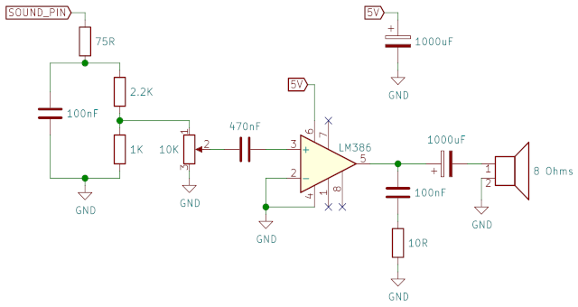

[<](README.md)

# Week 04 - DevLog


## Outcomes 

<!-- 
Using the backslash preserves the list number 
https://stackoverflow.com/a/50916345/441878 
-->


1\. 📚Read Philip K. Dick Pay for the Printer (1956) and The Preserving Machine (1953). Write a reflection below:

- These stories about relying on Biltongs and bizarre “preserving machines” really remind me of the current AI era, where it’s tempting to let tools do everything for us. They feel like warnings that if we outsource too much, we risk losing the skills and understanding behind what we make. A good reminder that we need to keep practicing things by hand so one can stay sharp and don’t become dependent on “black boxes."

2\. Connect a concept from [Synthesizing with Moog | Lesson 4: Resonance](https://www.youtube.com/watch?v=6spVzRqOsVw) to an aspect of the interface in the [Learning Synth Playground](https://learningsynths.ableton.com/en/playground) by Ableton 

- In Synthesizing with Moog | Lesson 4, resonance is described as boosting the frequencies right at the filter’s cutoff point, which creates a sharp peak and sometimes even a ringing tone. In the Learning Synth Playground, this concept appears in the Low-Pass Filter’s Resonance slider. If you increase it, you can see and hear how the filter curve shows a visible peak at the cutoff frequency.


3\. 📚Read Chapter 1 Get to know your  Raspberry Pi Pico (8-19) in [Get Started with MicroPython on Raspberry Pi Pico](https://www.mclibre.org/descargar/docs/revistas/hackspace-books/hackspace-get-started-with-micropython-on-pico-01-202101.pdf). Read and follow tutorial to install the MicroPython firmware on Pico.

p.20–25 - Read and follow tutorial to install Thonny and run the "Hello, World!" Add documentation below to show you can save and run python code on the Pico.

- Read & Installed 

4\. What is the difference between a microcontroller and a regular computer? (Chapter 1)

- A microcontroller runs one program and controls hardware directly via GPIO pins and a regular computer runs a full OS and handles many programs at once.

5\. 📚Read Chapter 2 (20–33) Programming with MicroPython. Summarize steps to program the Pico from your computer.

- Install and open Thonny IDE -> connect Pico via micro USB -> select MicroPython (Raspberry Pi Pico) as the interpreter -> write code in the editor -> click Run -> save the file to the Pico as `main.py` so it runs automatically on boot.


6\. 📚Read Chapter 2: "Challenge: New Message" (26) - You can display programming code in a markdown file using three backticks, a new line, and then three more backticks on the following line. 

```python
print("Welcome!")
```


7\. Chapter 2: "Challenge: Loop the Loop" (26)

```python
for i in range(10):
    print("Loop number", i)
```

8\. Chapter 2: "Challenge: Add More Questions" (26)

```python
user_name = input("What is your name? ")
age = input("How old are you? ")

if int(age) > 5:
    print("older than 5")
else:
    print("5 or younger")
```


9\. 📚Read Chapter 3 (34–43) Physical Computing. How many Ground pins are on the Pico?

- There are **8** Ground (GND) pins on the Raspberry Pi Pico.


10\. Post sketches for your musical instrument concept along with a potential parts list.

- [Plan & components](pico_8bit_guide_ready.docx)
-  - Schematic doesn’t show the Pico, *sound_pin* is where the connection to the Pico happens.


## Other experiments

<!-- 
Share details about other electronic experiments you are working on this week?
-->

- 


## Questions to bring up in class

<!-- 
Share questions you would like to bring up in class.
-->

- 